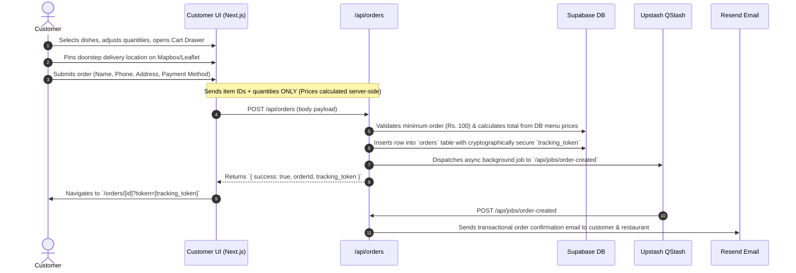

# SYSTEM_CONTEXT.md — IPL Dhaba Realtime Platform Master Context & Architecture

This document serves as the **authoritative, single-source context guide** for developers and AI agents working on the **IPL Dhaba** codebase.

---

## 1. System Overview & Tech Stack

**IPL Dhaba** is a mobile-first, real-time food ordering and delivery web application built for IPL Dhaba (Singarayakonda, AP, India). It features real-time WebSocket order tracking, doorstep pin map selection, role-based staff administration, automated background queues, and a smart Google Review feedback funnel.

### Technology Stack
* **Framework**: Next.js 16 (App Router) + React 18 + TypeScript.
* **Styling**: Tailwind CSS + Custom CSS Variables (Tailwind `cream`, `ink`, `saffron`, `surface`, `border`, `muted` tokens supporting Light & Dark themes).
* **Database & Auth**: Supabase PostgreSQL with Row-Level Security (RLS), custom triggers, and Supabase Auth.
* **State Management**: Zustand (`useCartStore`, `useUserStore`) + TanStack Query (`@tanstack/react-query` v5).
* **Realtime**: Supabase Realtime (WebSocket channels `order-status-{id}`, `driver-location-{id}`).
* **Rate Limiting & Caching**: Upstash Redis REST API.
* **Async Background Queue**: Upstash QStash (webhooks to `/api/jobs/order-created`).
* **Maps & Geolocation**: Mapbox GL Web SDK + Leaflet fallback.
* **Email & SMS**: Resend (Transactional HTML emails) + Twilio (SMS OTP).
* **Hosting**: Vercel Global Edge Network.

---

## 2. Directory & Component Structure

```text
APP/
├── public/                     # Static images, PWA manifest, service worker
├── src/
│   ├── app/                    # Next.js App Router Pages & API Routes
│   │   ├── admin/              # Staff & Admin Management Pages
│   │   │   ├── dashboard/      # Admin order queue, menu availability, audit logs
│   │   │   ├── delivery/       # Rider task list & doorstep map routing
│   │   │   ├── login/          # Staff authentication portal
│   │   │   └── team/           # Team member onboarding & profile role controls
│   │   ├── api/                # Serverless Next.js API Routes
│   │   │   ├── admin/          # Analytics, Audit logs, Team management API
│   │   │   ├── auth/           # OTP generation & verification
│   │   │   ├── jobs/           # QStash background webhook handlers (order notification, email)
│   │   │   ├── menu/           # Category & MenuItem fetching + cache invalidation
│   │   │   └── orders/         # Secure order placement, tracking, & status updates
│   │   ├── contact/            # Support details & Google Maps location
│   │   ├── my-orders/          # Customer order history lookup
│   │   ├── orders/[id]/        # Public realtime order tracking page + review funnel
│   │   ├── layout.tsx          # Root Layout (QueryClientProvider, PostHog, Global Fonts)
│   │   └── page.tsx            # Customer Home Page (Hero, Category Chips, Diet Filter, Specials Carousel)
│   ├── components/             # React Components
│   │   ├── admin/              # Staff dashboard cards & stats overview
│   │   ├── customer/           # MenuCard, CartDrawer, CategoryChips, ItemModal
│   │   ├── orders/             # StatusTimeline, TrackingMapLazy
│   │   ├── shared/             # Navbar, ThemeToggle
│   │   └── ui/                 # Reusable UI primitives (Button, Card, Badge, Input)
│   ├── hooks/                  # Custom Hooks (e.g. useDeliveryLocation)
│   ├── lib/                    # Supabase client/server singletons, Redis client, utils
│   ├── providers/              # React Query context provider
│   ├── services/               # Resend email template compilers & senders
│   ├── store/                  # Zustand stores (useCartStore, useUserStore)
│   ├── types/                  # Shared TypeScript interfaces (Order, MenuItem, Profile, Category)
│   └── proxy.ts                # Next.js 16 Edge Middleware (Route guards, OWASP headers, Rate limit)
├── supabase/
│   └── migrations/             # SQL Migrations (Schema, RLS, Triggers, Indexes)
├── package.json
└── tsconfig.json
```

---

## 3. Detailed User Flows

### Flow 1: Customer Food Ordering & Checkout


### Flow 2: Live Realtime Order Tracking & Google Review Funnel
1. **Realtime Status Timeline**:
   - Customer opens `/orders/[id]?token=[tracking_token]`.
   - The page subscribes to Supabase Realtime WebSocket channel `order-status-[id]`.
   - As staff update order status (`placed` ➔ `confirmed` ➔ `preparing` ➔ `out_for_delivery` ➔ `delivered`), updates stream instantaneously to the timeline without refreshing.
2. **Live Driver Tracking**:
   - When status transitions to `out_for_delivery`, `TrackingMapLazy` renders a Mapbox canvas showing restaurant pins, customer doorstep pins, and active driver locations.
3. **Google Review Feedback Funnel**:
   - When status reaches `delivered`, the **Rate Your Experience** prompt unlocks.
   - **4–5 Stars**: Prompts the user to leave a review on Google Maps (opens in a new tab) and logs click telemetry in `reviews.google_review_clicked`.
   - **1–3 Stars**: Collects private feedback in the `reviews` table for internal quality control.

### Flow 3: Staff & Admin Management
1. **Authentication & RBAC**:
   - Staff log in at `/admin/login`. Auth tokens set HTTP cookies via `@supabase/ssr`.
   - Next 16 Edge Middleware (`src/proxy.ts`) validates roles (`owner`, `admin`, `super_admin`, `manager`, `delivery`).
2. **Kitchen & Manager Dashboard (`/admin/dashboard`)**:
   - **Realtime Queue**: Automatically listens to WebSocket changes on `orders` table.
   - **Status Actions**: Confirms orders, marks items cooking, assigns riders, or cancels orders with reasons.
   - **Menu Item Toggles**: Instant IN STOCK / OUT OF STOCK buttons update `menu_items.is_available` and purge menu cache via `/api/menu/invalidate`.
   - **Audit Logs**: Inspects security events (`LOGIN`, `ROLE_CHANGE`, `MENU_TOGGLE`, `ORDER_CANCELLED`).

---

## 4. Database Schema & Security Principles

### Core Schema Models

#### `profiles` Table (User Accounts & Staff Roles)
```sql
CREATE TABLE public.profiles (
  id UUID PRIMARY KEY REFERENCES auth.users(id) ON DELETE CASCADE,
  email TEXT UNIQUE NOT NULL,
  full_name TEXT,
  phone TEXT,
  role TEXT NOT NULL DEFAULT 'customer' CHECK (role IN ('customer', 'delivery', 'manager', 'admin', 'super_admin', 'owner')),
  status TEXT NOT NULL DEFAULT 'active' CHECK (status IN ('active', 'pending_approval', 'deactivated')),
  active BOOLEAN NOT NULL DEFAULT true,
  avatar_url TEXT,
  vehicle_type TEXT,
  created_at TIMESTAMPTZ NOT NULL DEFAULT now(),
  updated_at TIMESTAMPTZ NOT NULL DEFAULT now()
);
```

#### `orders` Table
```sql
CREATE TABLE public.orders (
  id UUID PRIMARY KEY DEFAULT gen_random_uuid(),
  order_number SERIAL UNIQUE,
  customer_id UUID REFERENCES public.profiles(id),
  status public.order_status DEFAULT 'placed',
  subtotal NUMERIC(10,2) NOT NULL,
  delivery_fee NUMERIC(10,2) DEFAULT 30.00,
  total_amount NUMERIC(10,2) NOT NULL,
  delivery_address JSONB NOT NULL,
  delivery_instructions TEXT,
  payment_method public.payment_method DEFAULT 'cod',
  payment_status public.payment_status DEFAULT 'pending',
  estimated_delivery_at TIMESTAMPTZ,
  delivered_at TIMESTAMPTZ,
  cancelled_reason TEXT,
  assigned_delivery_id UUID REFERENCES public.profiles(id),
  tracking_token TEXT NOT NULL UNIQUE,
  created_at TIMESTAMPTZ DEFAULT now(),
  updated_at TIMESTAMPTZ DEFAULT now()
);
```

### Security & Data Integrity Safeguards
1. **Server-Side Price Calculation**: Client cart payloads send only `{ item_id, quantity }`. The server fetches item prices directly from Supabase, preventing tampering.
2. **Minimum Order Enforcement**: Enforces a minimum subtotal of **Rs. 100** before orders can be created.
3. **Role Change Lockdown**: Role updates (`profiles.role`) are restricted by PostgreSQL triggers. Only `super_admin` / `owner` can invoke administrative role adjustments via `admin_set_role()`.
4. **Anonymous Tracking Tokens**: Guest orders generate a unique 32-byte `tracking_token`. Public tracking access requires matching this token.
5. **Edge Security & OWASP Headers**: Next 16 Middleware injects CSP, X-Frame-Options, HSTS, and X-Content-Type-Options headers, and applies Upstash Redis IP rate limiting (120 req/min).

---

## 5. Design System & Theme Principles

* **Color Palette**:
  - `saffron`: `#FF6B00` (Brand Primary, Active Buttons, Badges)
  - `cream`: `#FFF8F0` (Light Theme BG) | `#09090B` (Dark Theme BG)
  - `ink`: `#1C1C1C` (Light Theme Text) | `#FAFAFA` (Dark Theme Text)
  - `surface`: `#FFFFFF` (Light Card Surface) | `#18181B` (Dark Card Surface)
  - `border`: `#E8E0D5` (Light Border) | `#27272A` (Dark Border)
  - `muted`: `#6B6B6B` (Light Muted Text) | `#A1A1AA` (Dark Muted Text)
* **Typography**:
  - Display Font: `Yatra One` (Google Font)
  - Body Font: `Inter` (Google Font)

---

## 6. Key Commands Reference

```bash
# Start local development server
npm run dev

# Run TypeScript type check
npx tsc --noEmit

# Run ESLint audit
npm run lint

# Build production bundle
npm run build
```
